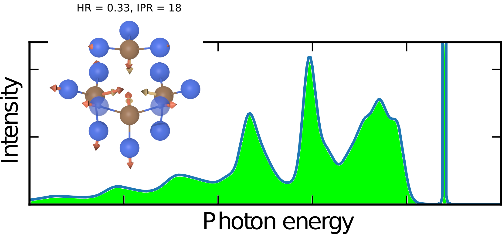

<p align="center">
  
</p>

# Optical Absorption Analysis
This repository provides a suite of tools designed to enhance evaluations of defect centers in semiconducting materials through photoluminescence (PL) spectrum calculations.


## Installation
```bash
python3 -m venv .venv
source ./.venv/bin/activate
pip3 install -r requirements.txt
```

## How To Use
This is a help
```bash
python pl_spectrum.py -h
usage: pl_spectrum.py [-h] [-gs GROUND_STATE_POSCAR] [-es EXCITED_STATE_POSCAR] [-ph PHONON_FILE]
                      [-temp TEMPERATURE] [-zpl ZPL_ENERGY]

optional arguments:
  -h, --help            show this help message and exit
  -gs GROUND_STATE_POSCAR, --ground-state-poscar GROUND_STATE_POSCAR
                        Enter the ground state POSCAR file
  -es EXCITED_STATE_POSCAR, --excited-state-poscar EXCITED_STATE_POSCAR
                        Enter the excited state POSCAR file
  -ph PHONON_FILE, --phonon-file PHONON_FILE
                        enter the ground state qpoints.yaml file
  -temp TEMPERATURE, --temperature TEMPERATURE
                        Enter temperature in Kelvin
  -zpl ZPL_ENERGY, --zpl-energy ZPL_ENERGY
                        Enter zero point energy in eV
```

#### sample:
```bash
python pl_spectrum.py -gs POSCAR-gs -es POSCAR-ex -ph qpoints.yaml -temp 300 -zpl 1.2
```

## Related
<https://journals.aps.org/prb/abstract/10.1103/PhysRevB.103.125203>
<https://journals.aps.org/prb/abstract/10.1103/PhysRevB.101.144109>
